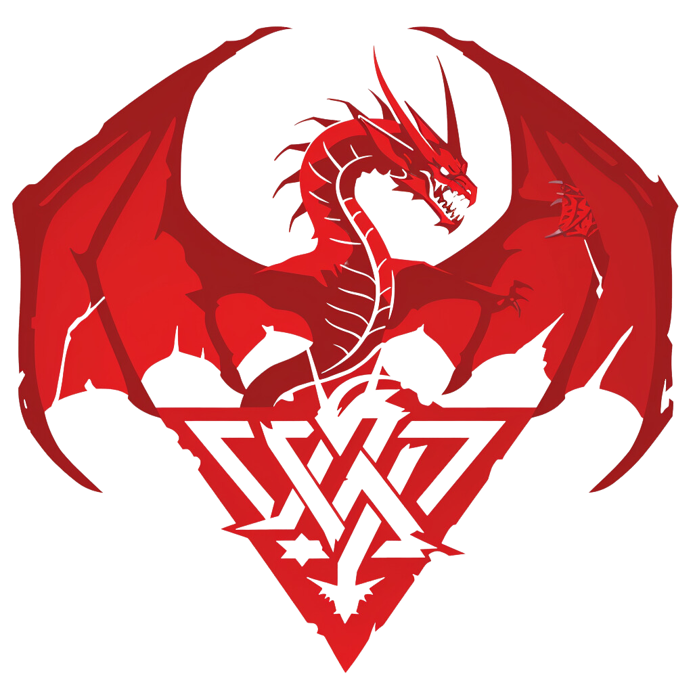

<p align="center"></p>

# The Ultimate Dungeons & Dragons App
This is a full stack web app that allows someone to search for Dungeons & Dragons info and pictures.  It's a fun project to explore some of the finer points of NextJS, graphQL and Material, and play with Midjourney (filling out the second half of the Monster Manual and creating the logo and favicon with generated images), among other things.  Enjoy!


## Development
### Setup
1. [Install nvm](https://github.com/nvm-sh/nvm?tab=readme-ov-file#installing-and-updating)
3. Clone this repo with `git clone git@github.com:CunningDJ/DnD-App.git`
4. In the repo directory, run `nvm use`, and `npm install`
Now you're ready to run the dev or production server! (see below)

### Run the development server
```bash
npm run dev
# or
yarn dev
# or
pnpm dev
# or
bun dev
```

### Lint & Fix
```bash
npm run lint # Check the lint
# or
npm run lint:fix # Check & auto-fix the lint
```

## Run the production server
```bash
# Builds the production code
npm run build

# Runs the production code
npm start
```

## Adding Monster Images
Below is the system for creating and adding new or missing monster images to the server.

### To generate Midjourney prompts for missing Monster images
This will fetch all of the monster names, check which corresponding image files are missing (see "to add more monster images to the server" below for the file name syntax), and print out the corresponding Midjourney prompts in chunks of 4 permutations (Midjourney's max permutations per prompt) to make generating the missing images easy.

```bash
npm run missingMj
```

Once the monster images are generated in Midjourney (or found elsewhere), follow the instructions below to serve them in the server.

### To add more monster images to the server
1. Add a higher-res monster pngs to public/img/monsters/png/, with hyphens instead of spaces, lowercase, and only parentheses preserved aside from alphanumeric, e.g.
   * "Goblin Fiend (Fire)" should be named `goblin-fiend-(fire).png`
   * "Red Hawk, Night" should be named `red-hawk-night.png`
2. Run `npm run genMonsterJpgs` to convert all of these high-res pngs into more website-friendly, medium-res (max dimension 600px) jpegs and move them into the main server folder
3. `git add` the new `.jpg`s in public/img/monsters (they should show up as untracked in `git status`)
